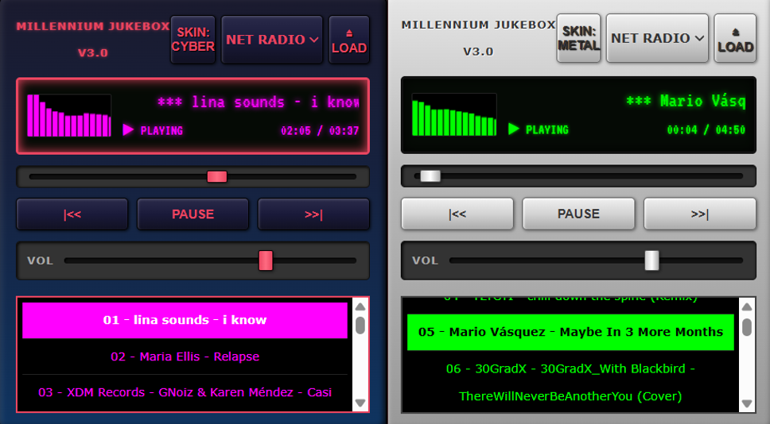

# 💽 Millennium Jukebox



[cite_start]**Millennium Jukebox** is a fully functional, retrofuturistic web audio player that captures the "Digital Maximalism" and "Blobject" aesthetics of the late '90s and early 2000s[cite: 76, 106]. [cite_start]Inspired by iconic software like Winamp and the design language of the original iMac G3, it blends turn-of-the-century tech optimism with a modern React engine[cite: 77, 107].

### ✨ Key Features

* [cite_start]**Local File Playback:** Load your own `.mp3` files directly into the playlist using the "Eject/Load" button[cite: 78, 108].
* [cite_start]**Internet Radio Dial:** Stream trending tracks by genre via the decentralized **Audius API**[cite: 79, 109].
* [cite_start]**Active Audio Visualizer:** Real-time green EQ bars that react to your music using the Web Audio API[cite: 80, 110].
* [cite_start]**Custom Hardware Skins:** Instantly toggle between the classic **"Liquid Metal"** look and a dark **"Neon Cyber"** theme[cite: 81, 111].
* [cite_start]**Precision LCD Display:** A digital time counter tracking current position and total duration[cite: 82, 112].

### 🛠️ Tech Stack

* [cite_start]**Core:** React + Vite [cite: 83, 113]
* [cite_start]**Audio Engine:** Native HTML5 Audio API + Web Audio API for visualization[cite: 83, 113].
* [cite_start]**Styling:** Advanced CSS utilizing complex gradients and `inset` box-shadows to recreate 3D plastic and metal textures[cite: 83, 114].

### 🚀 Getting Started

1.  **Clone the Repo:** ```bash
    git clone [https://github.com/shehandfernando/Millennium-Jukebox.git](https://github.com/shehandfernando/Millennium-Jukebox.git)
    ```
2.  **Install Dependencies:** ```bash
    npm install
    ```
3.  **Launch:** ```bash
    npm run dev
    ```
4.  [cite_start]**View:** Open `http://localhost:5173` in your browser[cite: 84, 116].

### 🔮 Future Roadmap

* [cite_start]**Keyboard Shortcuts:** Spacebar for play/pause and arrow keys to skip tracks[cite: 117, 278].
* [cite_start]**Time Display Toggle:** Swap the LCD between "Time Elapsed" and "Time Remaining"[cite: 118, 279].
* [cite_start]**Drag-and-Drop Playlist:** Rearrange playback order on the fly[cite: 119, 280].

---
*Built with nostalgia for the Y2K era.*